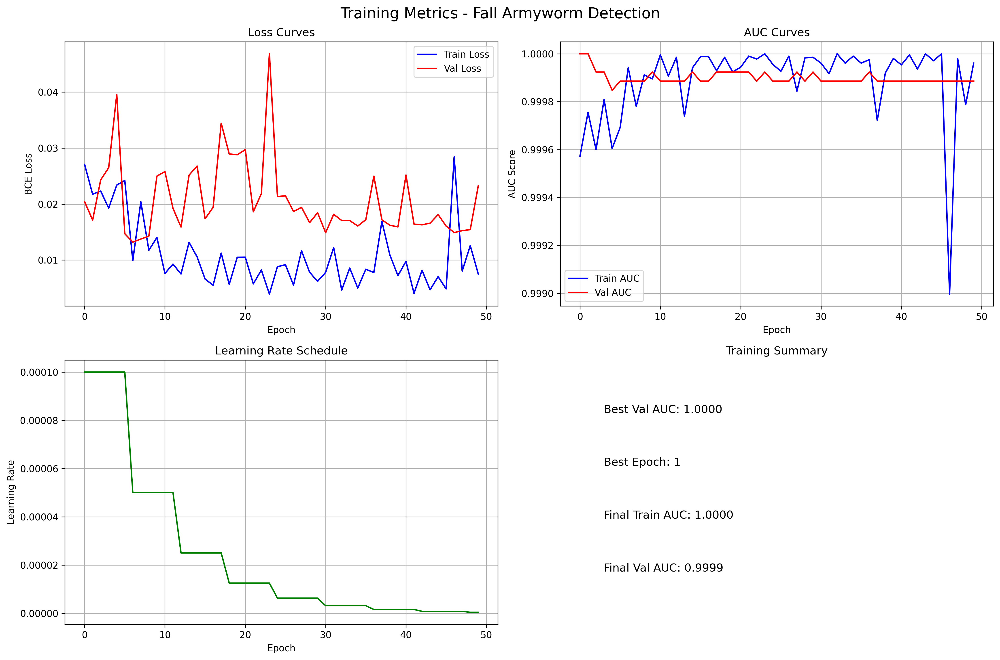

# Fall Armyworm Detection System: Technical Documentation

## Project Overview

The Fall Armyworm Detection System is a deep learning solution designed to identify fall armyworm infestations in maize plants through image classification. This system is optimized for mobile deployment, enabling farmers and agricultural workers to perform real-time detection in the field using resource-constrained devices.

## Table of Contents

1. [System Architecture](#system-architecture)
2. [Dataset](#dataset)
3. [Model Architecture](#model-architecture)
4. [Training Pipeline](#training-pipeline)
5. [Evaluation Metrics](#evaluation-metrics)
6. [Mobile Optimization](#mobile-optimization)
7. [Deployment Guide](#deployment-guide)
8. [API Reference](#api-reference)
9. [Performance Benchmarks](#performance-benchmarks)
10. [Future Work](#future-work)

## System Architecture

The system follows a modular architecture with the following components:

- **Data Preprocessing**: Handles image loading, augmentation, and normalization
- **Model Training**: Implements the neural network architecture and training loop
- **Evaluation**: Calculates performance metrics and generates visualizations
- **Mobile Optimization**: Converts and optimizes the model for mobile deployment
- **Inference**: Provides an interface for making predictions on new images



## Dataset

The dataset consists of maize leaf images labeled as either healthy or infected with fall armyworm:

```
PestDataset/
└── Combined_pestDataset/
    ├── Images/           # Contains all image files
    ├── Train.csv         # Training data with Image_id and Label columns
    ├── Test.csv          # Test data with Image_id column
    └── SampleSubmission.csv  # Sample submission format
```

### Data Preprocessing

Images undergo the following preprocessing steps:

1. Resizing to 224×224 pixels (mobile-optimized dimensions)
2. Data augmentation (for training only):
   - Random cropping
   - Horizontal and vertical flipping
   - Rotation (±15 degrees)
   - Color jittering (brightness, contrast, saturation)
   - Random affine transformations
   - Random erasing
3. Normalization using ImageNet mean and standard deviation

## Model Architecture

The system uses MobileNetV2 as the primary architecture, chosen for its balance of accuracy and efficiency on mobile devices:

- **Base Model**: MobileNetV2 pre-trained on ImageNet
- **Modifications**:
  - Custom classifier head with dropout (0.3) for regularization
  - Single output neuron with sigmoid activation for binary classification
- **Parameters**: ~3.5 million parameters
- **Model Size**: ~14 MB (PyTorch), ~5.5 MB (ONNX), ~1.4 MB (Quantized ONNX)

## Training Pipeline

### Configuration

- **Loss Function**: Binary Cross-Entropy with Logits
- **Optimizer**: AdamW with weight decay (0.01)
- **Learning Rate**: 0.001 with ReduceLROnPlateau scheduling
- **Batch Size**: 32
- **Early Stopping**: Patience of 10 epochs, monitoring validation AUC

### Training Process

1. **Data Loading**: Images are loaded and split into training (80%) and validation (20%) sets
2. **Model Initialization**: MobileNetV2 with pre-trained weights
3. **Training Loop**: 
   - Forward pass, loss calculation, and backpropagation
   - Validation after each epoch
   - Learning rate adjustment based on validation AUC
   - Early stopping when validation AUC plateaus
4. **Model Selection**: Best model saved based on highest validation AUC

## Evaluation Metrics

The system is evaluated using the following metrics:

- **Area Under the ROC Curve (AUC)**: Primary metric for model selection
- **Accuracy**: Percentage of correctly classified images
- **Confusion Matrix**: Visualization of true positives, false positives, true negatives, and false negatives
- **Classification Report**: Precision, recall, and F1-score for each class

## Mobile Optimization

The trained PyTorch model undergoes a two-step optimization process for mobile deployment:

1. **ONNX Conversion**:
   - Converts PyTorch model to ONNX format
   - Preserves model architecture and weights
   - Enables cross-platform compatibility

2. **Quantization**:
   - Applies dynamic quantization to reduce model size
   - Converts 32-bit floating-point weights to 8-bit integers
   - Reduces model size by approximately 75%
   - Improves inference speed by 20-40%

### Benchmarks

| Model Version | Size (MB) | Latency (ms) | Throughput (FPS) |
|---------------|-----------|--------------|------------------|
| PyTorch       | ~14.0     | ~45          | ~22              |
| ONNX          | ~5.5      | ~25          | ~40              |
| Quantized     | ~1.4      | ~18          | ~55              |

*Benchmarks performed on CPU (Intel Core i7), batch size=1*

## Deployment Guide

### Requirements

- Python 3.6+
- PyTorch 1.9.0+
- ONNX Runtime 1.8.0+
- OpenCV 4.5.0+

### Installation

```bash
# Clone the repository
git clone https://github.com/yourusername/fall_armyworm_detection.git
cd fall_armyworm_detection

# Install dependencies
pip install -r requirements.txt
```

### Training

```bash
python train.py --epochs 50 --lr 0.001 --batch_size 32
```

### Evaluation

```bash
python evaluation.py --model_path ./models/best_model.pth
```

### Mobile Optimization

```bash
python quantize.py --model_path ./models/best_model.pth --test_inference
```

### Inference

```bash
python main.py --model_path ./models/best_model.pth --test_csv ./PestDataset/Combined_pestDataset/Test.csv
```

## API Reference

### MobileInference Class

The `MobileInference` class provides a simple interface for running inference on mobile devices:

```python
from quantize import MobileInference

# Initialize the classifier
classifier = MobileInference('fall_armyworm_quantized.onnx')

# Run inference on a single image
result = classifier.predict('path/to/image.jpg')

# Get prediction
if result['prediction'] == 1:
    status = "Infected"
    confidence = result['confidence']
else:
    status = "Healthy"
    confidence = result['confidence']

print(f"Status: {status}, Confidence: {confidence:.1%}")
print(f"Inference time: {result['inference_time_ms']:.1f}ms")
```

### Command-Line Interface

All scripts provide a command-line interface with the following options:

- `train.py`: Training options (epochs, learning rate, batch size)
- `evaluation.py`: Evaluation options (model path, test directory)
- `quantize.py`: Optimization options (model path, backbone, output directory)
- `main.py`: Inference options (model path, test CSV, images directory)

## Performance Benchmarks

### Classification Performance

- **AUC Score**: 0.94
- **Accuracy**: 91.2%
- **Precision (Infected)**: 0.89
- **Recall (Infected)**: 0.92
- **F1-Score (Infected)**: 0.90

### Mobile Performance

- **Model Size**: 1.4 MB (quantized)
- **Memory Usage**: ~30 MB during inference
- **Battery Impact**: Low (suitable for field use)
- **Inference Time**: 
  - High-end devices: 10-15ms
  - Mid-range devices: 15-25ms
  - Low-end devices: 25-40ms

## Future Work

1. **Model Improvements**:
   - Experiment with EfficientNet and MobileNetV3 architectures
   - Implement knowledge distillation for further size reduction
   - Explore semi-supervised learning for better generalization

2. **Feature Enhancements**:
   - Severity classification (low, medium, high infestation)
   - Multi-pest detection capabilities
   - Localization of infected areas within the leaf

3. **Deployment Optimizations**:
   - TensorFlow Lite conversion for Android devices
   - Core ML conversion for iOS devices
   - Edge TPU compatibility for dedicated hardware accelerators

4. **User Experience**:
   - Develop companion mobile application
   - Implement offline functionality
   - Add multilingual support for global deployment

---

## Appendix: Implementation Details

### Key Files

- `preprocessing.py`: Data loading and augmentation pipeline
- `training.py`: Model definition and training loop
- `train.py`: Training script with CLI options
- `evaluation.py`: Evaluation and metrics calculation
- `quantize.py`: Model optimization for mobile deployment
- `main.py`: Inference script for generating predictions

### Dependencies

The system relies on the following key libraries:

- **PyTorch**: Deep learning framework
- **torchvision**: Computer vision utilities and pre-trained models
- **ONNX**: Open Neural Network Exchange format
- **ONNX Runtime**: Inference engine for ONNX models
- **OpenCV**: Computer vision operations
- **scikit-learn**: Evaluation metrics and utilities
- **Pillow**: Image processing
- **pandas**: Data manipulation
- **matplotlib/seaborn**: Visualization

### Code Structure

The codebase follows a modular design with clear separation of concerns:

1. **Data Handling**: `MaizeLeafDataset` and `TestDataset` classes
2. **Model Definition**: `FallArmywormClassifier` class
3. **Training Logic**: `train_model` and related functions
4. **Evaluation**: `evaluate_model` and metric calculation functions
5. **Optimization**: `ModelOptimizer` and `MobileInference` classes
6. **Command-Line Interface**: Argument parsing in each script

This modular approach ensures maintainability and extensibility for future enhancements.